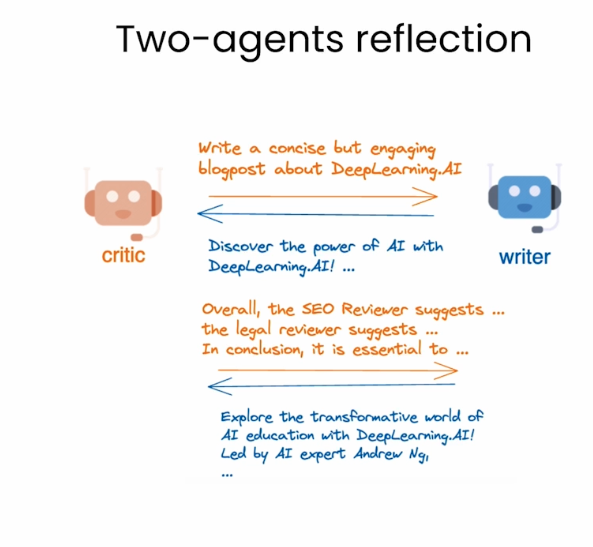

# Agent reflection
- agent reflection framework
- learn how to use the nested chat conversation pattern to realize a sophisticated reflection process

Considering a blog post wiriting task.

## Reflection
Reflection: notable and effective agentic design pattern. One way to realize reflection is to involve another agent to reflect on the work and help improve it.
 

- the critic agent was providing general suggestions...

If we want to realize a complex reflection workflow.
- if we want to ensure that the critic agent **provide criticism regarding certain aspects of the work**
  - if it has legal problems, etichs problem, etc.
We can handle this using **nested chats**
 
