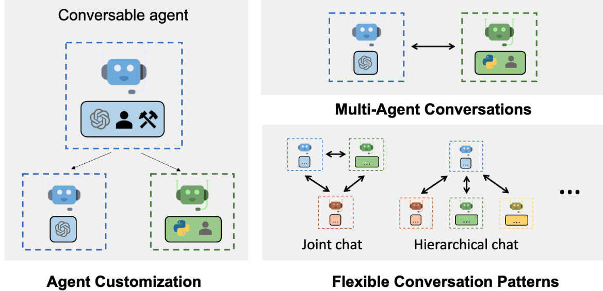

# AI-agents-with-AutoGen

AutoGen is a framework that enables development of LLM applications using multi-agents. AutoGen framework can be used with any model via API or locally within your own environment.

 

## Lessons
- [Lesson 1: Multi-Agent Conversation and Stand-up Comedy](https://github.com/Alessio1599/AI-agents-with-AutoGen/tree/main/1%20Multi-agent%20conversation%20and%20stand-up%20comedy)
- [Lesson 2: Sequential Chats and Customer Onboarding](https://github.com/Alessio1599/AI-agents-with-AutoGen/tree/main/2%20Sequential%20chats)
- [Lesson 3: Reflection and Blogpost Writing](https://github.com/Alessio1599/AI-agents-with-AutoGen/tree/main/3%20Reflection%20and%20Blogpost%20Writing)
- [Lesson 4: Tool Use and Conversational Chess](https://github.com/Alessio1599/AI-agents-with-AutoGen/tree/main/4%20Tool%20Use%20and%20Conversational%20Chess)
- [Lesson 5: Coding and Financial Analysis](https://github.com/Alessio1599/AI-agents-with-AutoGen/tree/main/5%20Coding%20and%20Financial%20Analysis)
- [Lesson 6: Planning and Stock Report Generation](https://github.com/Alessio1599/AI-agents-with-AutoGen/tree/main/6%20Planning%20and%20Stock%20Report%20Generation)

## Table of contents
- [AI-agents-with-AutoGen](#ai-agents-with-autogen)
  - [Lessons](#lessons)
  - [Table of contents](#table-of-contents)
  - [Directory structure](#directory-structure)
  - [Getting started](#getting-started)
  - [Example of code](#example-of-code)
  - [References](#references)

## Directory structure 
```
AI-agents-with-AutoGen/
├── 1 Multi-agent conversation and stand-up comedy
│   ├── L1_Multi-Agent_Conversation_and_Stand-up_Comedy.ipynb
│   ├── README.md
│   ├── requirements.txt
│   └── utils.py
├── 2 Sequential chats and Customer Onboarding
│   ├── L2_Sequential_Chats_and_Customer_Onboarding.ipynb
│   └── README.md
├── 3 Reflection and Blogpost Writing
│   ├── L3_Reflection_and_Blogpost_Writing.ipynb
│   └── README.md
├── 4 Tool Use and Conversational Chess
│   ├── L4_Tool_Use_and_Conversational_Chess.ipynb
│   └── README.md
├── 5 Coding and Financial Analysis
│   ├── L5_Coding_and_Financial_Analysis.ipynb
│   └── README.md
├── 6 Planning and Stock Report Generation
│   ├── L6-Planning_and_Stock_Report_Generation.ipynb
│   └── README.md
├── AI_agent_autogen.py
├── AI_agents_thesis
│   └── README.md
├── OpenAI_API
│   ├── GPT3-5-turbo.py
│   ├── GPT4.py
│   ├── README.md
│   ├── freecodecamp.py
│   ├── main.py
│   └── short_story.txt
├── README.md
├── coding
├── finetune_LLM
│   ├── README.md
│   └── sentiment_analysis.py
├── hugging-face
│   ├── GPT2.py
│   ├── GPTNeo.py
│   └── README.md
├── img
│   ├── conversations.png
│   ├── customer_onboarding_task.png
│   ├── intro.png
│   ├── nested chats.png
│   └── reflection.png
└── requirements.txt
```

## Getting started
```bash
pip install pyautogen
```

## Example of code

- define agents
- define chat
- initiate chat
- see the chat history, and also the cost
  
```python
from autogen import ConversableAgent

llm_config={"model":"gpt-3.5-turbo"}

agent = ConversableAgent(
    name='chatbot',
    system_message='You are a chatbot and you are an expert financial advisor'
    llm_config=llm_config,
    human_input_mode='NEVER'
)
```

By setting the system message, we can define the behavior of the agent.

**Summary methods**:
- "reflection_with_llm"

**summary_prompt**, to instruct the llm on how to do the summary

## References
1. [AI Agentic Design Patterns with AutoGen, DeepLearning.AI, short course](https://www.deeplearning.ai/short-courses/ai-agentic-design-patterns-with-autogen/)
2. [AutoGen website, an Open-Source Programming Framework for Agentic AI](https://microsoft.github.io/autogen/)
   1. [Getting started](https://microsoft.github.io/autogen/docs/Getting-Started)